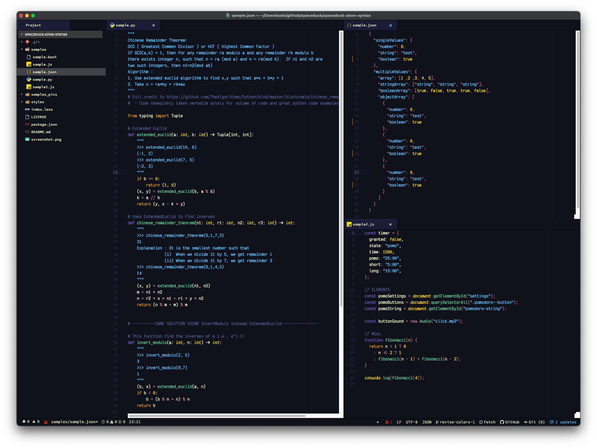
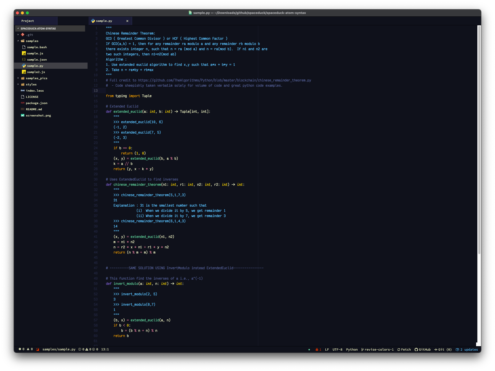
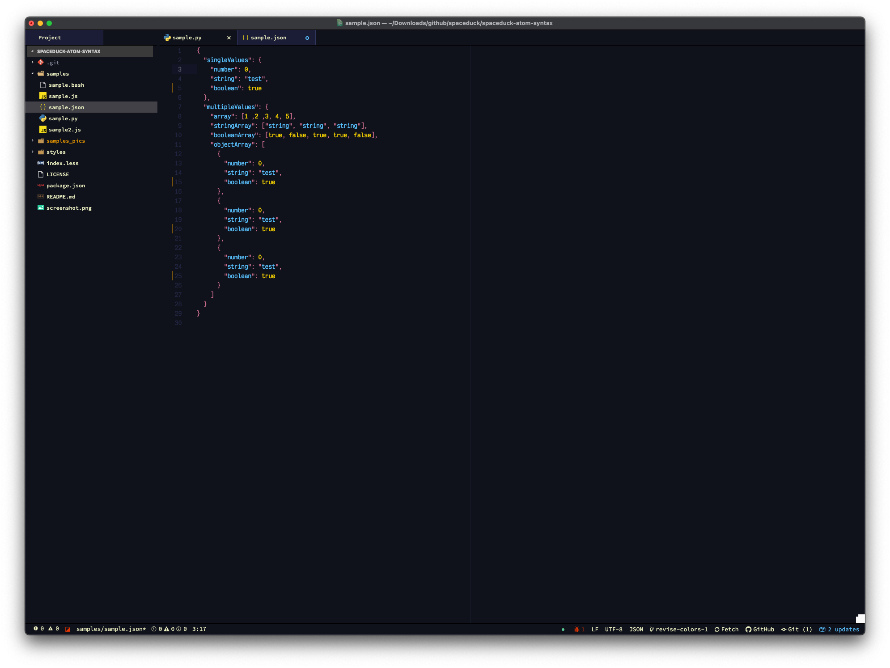

# Spaceduck for [Atom (Syntax)](https://atom.io/)

> A [spaceduck](https://github.com/pineapplegiant/spaceduck) theme for [Atom (Syntax)](https://atom.io/)



---

## Atom Package Repository
Can be found [here](https://atom.io/packages/spaceduck-syntax).

## Install

Follow one of the methods below to install, and once done, proceed to [activating the theme](#activating-theme).

#### Install using Atom

1. Go to `Atom/Edit -> Preferences...`
2. Then select the `Install` tab
3. Click the `Themes` button to the right of the search box
4. Enter `spaceduck-syntax` in the search box

#### Install using Atom Package Manager

```bash
apm install spaceduck-syntax
```

#### Install using Git

Alternatively, if you are a git user, you can install the theme and keep up to date by cloning the repo directly into your `~/.atom/packages` directory:

```bash
git clone https://github.com/bigpick/spaceduck-atom-syntax.git ~/.atom/packages/spaceduck-syntax
```

#### Install manually

1. Download using the [GitHub .zip download](https://github.com/dracula/spaceduck-atom-syntax/archive/main.zip) option and unzip them.
2. Move the `spaceduck-syntax` folder to `~/.atom/packages`

## Activating theme

Once installed, go to `Atom -> Preferences...`, click in the `Themes` tab, and select `Spaceduck` in the `Syntax Theme` dropdown.

---

## More Previews
### Markdown


> A quote looks like this.
>
> "I don't care if it works on your machine! We are not shipping your machine!"

A list:

1. First item
2. Second Item
3. Third Item

* Bullet
* Bullet2
   * Indented bullet

Here is some **bold** text, and this is _italic_.


### Python


### JSON


### JS


## License

[MIT License](./LICENSE)
